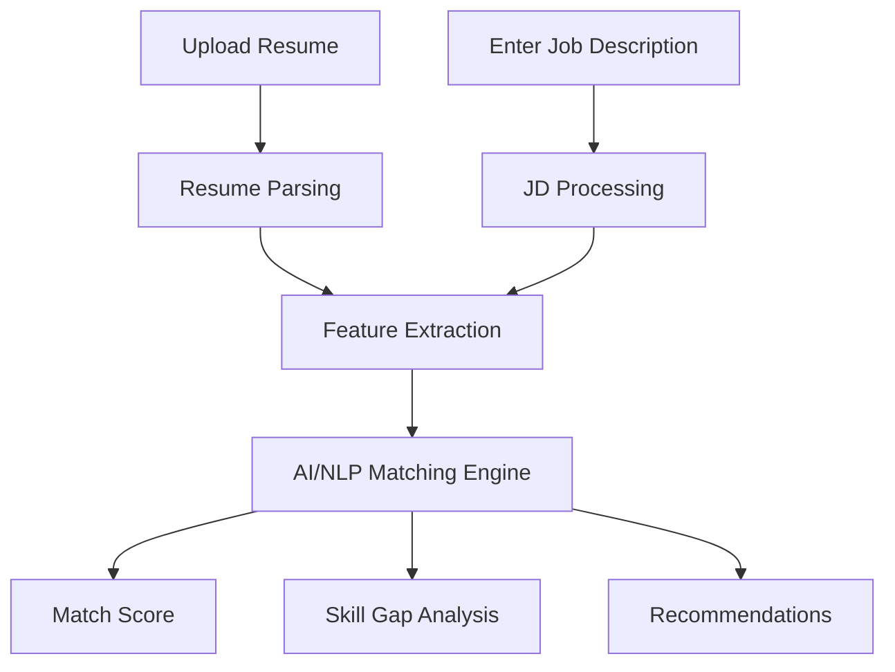

<div align="center">

# 🚀 JobMatchAI
### *AI-Powered Resume Screening & Job Matching Platform*


<p align="center">
  <b>JobMatchAI</b> is an intelligent AI-based platform that helps match resumes with job descriptions using <b>NLP</b>, <b>semantic similarity</b>, and <b>AI-powered insights</b>.
</p>

</div>

---

## 📌 Overview

Recruiters often spend a lot of time manually screening resumes, while candidates struggle to understand whether their profile aligns with a role.

**JobMatchAI** solves this by using **Artificial Intelligence + Natural Language Processing (NLP)** to:

- 📄 Analyze resumes
- 🧠 Understand job descriptions
- 🎯 Match candidates with relevant jobs
- 📊 Provide matching scores and insights
- 💡 Help improve resume-job alignment

---

## ✨ Key Features

- 🔍 **Resume Parsing**
  - Extracts relevant details such as skills, education, projects, and experience.

- 🧠 **AI-Based Job Matching**
  - Compares resume content with job descriptions using NLP and semantic understanding.

- 📊 **Match Score Generation**
  - Generates a compatibility score between candidate profile and job role.

- 🏷️ **Skill Gap Analysis**
  - Identifies missing or weak skills for a target role.

- 💬 **Smart Recommendations**
  - Suggests improvements to boost job compatibility.

- ⚡ **Fast & Scalable**
  - Designed to automate and simplify resume shortlisting workflows.

---

## 🛠️ Tech Stack

### **Frontend**
- HTML / CSS / JavaScript  
- *(Add React / Streamlit / Tailwind if you used them)*

### **Backend**
- Python / Flask / FastAPI  
- *(Replace with your actual backend stack if different)*

### **AI / ML / NLP**
- Python
- Scikit-learn
- Pandas / NumPy
- NLP-based similarity models
- Sentence Embeddings / TF-IDF / Cosine Similarity  
- *(Add OpenAI / Gemini / LangChain / Transformers if used)*

### **Database / Storage**
- SQLite / MongoDB / Firebase / PostgreSQL  
- *(Replace with your actual DB)*

### **Deployment**
- GitHub
- Render / Vercel / Railway / Hugging Face / Streamlit Cloud  
- *(Add actual deployment platform)*

---

## 🧠 How It Works



### Workflow:
1. User uploads a **resume**
2. System processes the **job description**
3. AI engine compares both documents
4. Generates:
   - Match percentage
   - Skill overlap
   - Missing keywords
   - Suggestions for improvement

---

## 📂 Project Structure

```bash
JobMatchAI/
│── app/                  # Main application files
│── models/               # ML/NLP models
│── data/                 # Sample resumes / job descriptions
│── static/               # CSS / JS / assets
│── templates/            # HTML templates
│── utils/                # Helper functions
│── notebooks/            # Experiment / analysis notebooks
│── requirements.txt      # Python dependencies
│── README.md             # Project documentation
│── main.py / app.py      # Entry point
```

> ⚠️ Update this structure according to your actual repository.

---

## 🚀 Installation & Setup

### 1️⃣ Clone the Repository

```bash
git clone https://github.com/Deepakkumar5570/JobMatchAI.git
cd JobMatchAI
```

### 2️⃣ Create Virtual Environment

```bash
python -m venv venv
```

### 3️⃣ Activate Environment

#### Windows
```bash
venv\Scripts\activate
```

#### Mac/Linux
```bash
source venv/bin/activate
```

### 4️⃣ Install Dependencies

```bash
pip install -r requirements.txt
```

### 5️⃣ Run the Project

```bash
python app.py
```

> If your main file is different (e.g. `main.py`, `streamlit_app.py`), update the command accordingly.

---

## 💻 Usage

- Upload a resume file
- Paste or upload a job description
- Let the AI analyze both
- View:
  - Match score
  - Matching skills
  - Missing skills
  - Suggestions to improve

---

## 📸 Screenshots

> Add screenshots here for better GitHub appeal 👇

### 🏠 Home Page
```md

```

### 📄 Resume Analysis
```md

```

### 📊 Match Results
```md

```

---

## 🎯 Use Cases

- 👨‍💼 **Recruiters** → Faster resume screening
- 🎓 **Students / Freshers** → Know job fit before applying
- 💼 **Job Seekers** → Improve resumes for ATS and AI filters
- 🏢 **HR Teams** → Automate candidate shortlisting

---

## 📈 Future Improvements

- [ ] Resume ranking for multiple candidates
- [ ] ATS compatibility checker
- [ ] AI-generated resume improvement suggestions
- [ ] Cover letter generation
- [ ] Job recommendation engine
- [ ] Interview question generation
- [ ] Dashboard with analytics
- [ ] Multi-language support
- [ ] RAG-based company/job intelligence

---

## 🧪 Possible AI Enhancements

- Semantic Search using **Sentence Transformers**
- LLM-powered resume review
- Skill extraction using **NER**
- Job-role clustering
- Candidate-job explainability
- Personalized career path suggestions

---

## 🤝 Contributing

Contributions are welcome! 🎉

If you'd like to improve this project:

1. Fork the repository
2. Create your feature branch  
   ```bash
   git checkout -b feature/YourFeature
   ```
3. Commit your changes  
   ```bash
   git commit -m "Add YourFeature"
   ```
4. Push to the branch  
   ```bash
   git push origin feature/YourFeature
   ```
5. Open a Pull Request 🚀

---

## 🧑‍💻 Author

### **Deepak Kumar**
AI/ML Enthusiast | Developer | Problem Solver

- 🔗 GitHub: [@Deepakkumar5570](https://github.com/Deepakkumar5570)
- 💼 LinkedIn: *(Add your LinkedIn here)*
- 📧 Email: *(Add your email here)*

---

## 📄 License

This project is licensed under the **MIT License**.  
Feel free to use, modify, and improve it.

---

<div align="center">

### ⭐ If you like this project, don't forget to star the repo!

**Made with ❤️ by Deepak Kumar**

</div>
