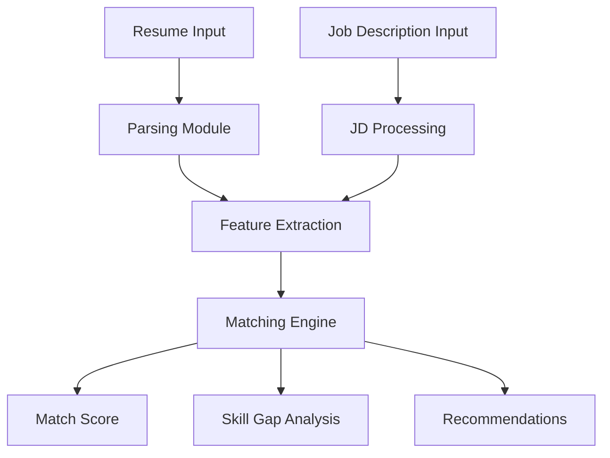

<div align="center">

# 🚀 JobMatchAI  
### AI-Powered Resume Screening & Job Matching Platform  


<br><br>


</div>

---

## 🌍 Problem Statement

Recruitment today faces two major inefficiencies:

- **Recruiters** manually scan hundreds of resumes → time-consuming & inconsistent  
- **Candidates** apply blindly → low success rate due to poor job alignment  

Traditional ATS systems rely heavily on **keyword matching**, missing **context, semantics, and real skill relevance**.

---

## 💡 Solution: JobMatchAI Try it here https://job-match-ai-five.vercel.app/

**JobMatchAI** is an AI-powered system that uses **NLP + semantic similarity + machine learning** to intelligently match resumes with job descriptions.

It goes beyond keyword matching and answers:

- “How well does this candidate actually fit this role?”
- “What skills are missing?”
- “How can the resume be improved?”

---

## 🎯 What This Project Solves

| Problem | Solution |
|--------|---------|
| Manual resume screening | Automated AI-based evaluation |
| Poor job-fit understanding | Match score + semantic analysis |
| Missing skills not identified | Skill gap detection |
| No actionable feedback | Smart recommendations |

---

## ⚙️ Core Features

### 🔍 1. Resume Parsing
- Extracts structured information:
  - Skills
  - Experience
  - Projects
  - Education

---

### 🧠 2. NLP-Based Matching Engine
- Converts resume + JD into vector representations
- Uses:
  - TF-IDF / embeddings
  - Cosine similarity
  - Semantic comparison

---

### 📊 3. Match Score
- Outputs a **percentage score**
- Reflects real alignment (not just keywords)

---

### 🧩 4. Skill Gap Analysis
- Identifies:
  - Missing skills
  - Weak areas
- Helps candidates understand **why they are not selected**

---

### 💡 5. Smart Recommendations
- Suggests:
  - Skills to add
  - Resume improvements
  - Better alignment strategies

---

## 🧠 System Architecture


## 🔬 How It Works (Deep Dive)

### Step 1: Input Processing
- Resume → parsed into structured text  
- Job Description → cleaned and normalized  

---

### Step 2: Feature Extraction
- Convert text into numerical vectors using:
  - TF-IDF  
  - Sentence Embeddings  

---

### Step 3: Matching Algorithm
- Compute similarity using:
  - Cosine Similarity  

- Identify:
  - Overlapping skills  
  - Missing keywords  

---

### Step 4: Output Generation
- Match Score (%)  
- Matching Skills  
- Missing Skills  
- Recommendations  

---

## 🛠️ Tech Stack

### Backend
- Python  
- FastAPI / Flask  

---

### ML / NLP
- Scikit-learn  
- Pandas / NumPy  
- TF-IDF / Embeddings  
- Cosine Similarity  

---

### Optional Enhancements
- Transformers (BERT / Sentence Transformers)  
- LangChain / Gemini / OpenAI

---

### Getting Started
1. Clone Repo
  ```
  git clone https://github.com/Deepakkumar5570/JobMatchAI.git
  cd JobMatchAI
  ```
2. Setup Environment
  ```
   python -m venv venv
   source venv/bin/activate   # Mac/Linux
   venv\Scripts\activate      # Windows
  ```
3. Install Dependencies
  ```
    pip install -r requirements.txt
  ```
4. Run Application
  ```
    uvicorn app.main:app --reload
  ```
## 💻 How to Use

1. Upload Resume  
2. Paste Job Description  
3. Click **Analyze**  

### 📊 Output:
- Match Score  
- Skill Match Breakdown  
- Missing Skills  
- Suggestions  

---

## 🧑‍💻 For Contributors

### 🧩 Where You Can Contribute

#### 1. Improve Matching Engine
Replace TF-IDF with:
- Sentence Transformers  
- BERT embeddings  

---

#### 2. Add New Features
- Resume ranking system  
- Multi-candidate comparison  
- Interview question generator  
- Resume rewriting AI  

---

#### 3. Improve Parsing
Better extraction using:
- Named Entity Recognition (NER)  
- Regex improvements  

---

#### 4. Frontend Enhancements
- Dashboard UI  
- Visualization of scores  
- Skill graphs  

---

### 🛠️ Contribution Workflow

```bash
# Fork repo
# Clone your fork

git checkout -b feature/your-feature
git commit -m "Added new feature"
git push origin feature/your-feature
```
## 🧪 Future Roadmap

- [ ] LLM-based resume feedback  
- [ ] ATS compatibility scoring  
- [ ] Job recommendation system  
- [ ] Career path prediction  
- [ ] Real-time recruiter dashboard  
- [ ] RAG-based job intelligence  

---

## 🎯 Use Cases

- 👨‍💼 Recruiters → Automated screening  
- 🎓 Students → Check job readiness  
- 💼 Job Seekers → Optimize resumes  
- 🏢 Companies → Build internal ATS  

---

## 👨‍💻 Author

**Deepak Kumar**  
AI/ML Developer | Problem Solver  

- GitHub: https://github.com/Deepakkumar5570  

   


   
   

